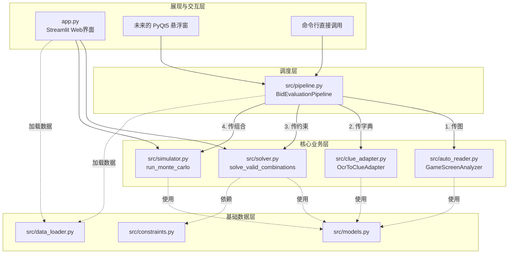
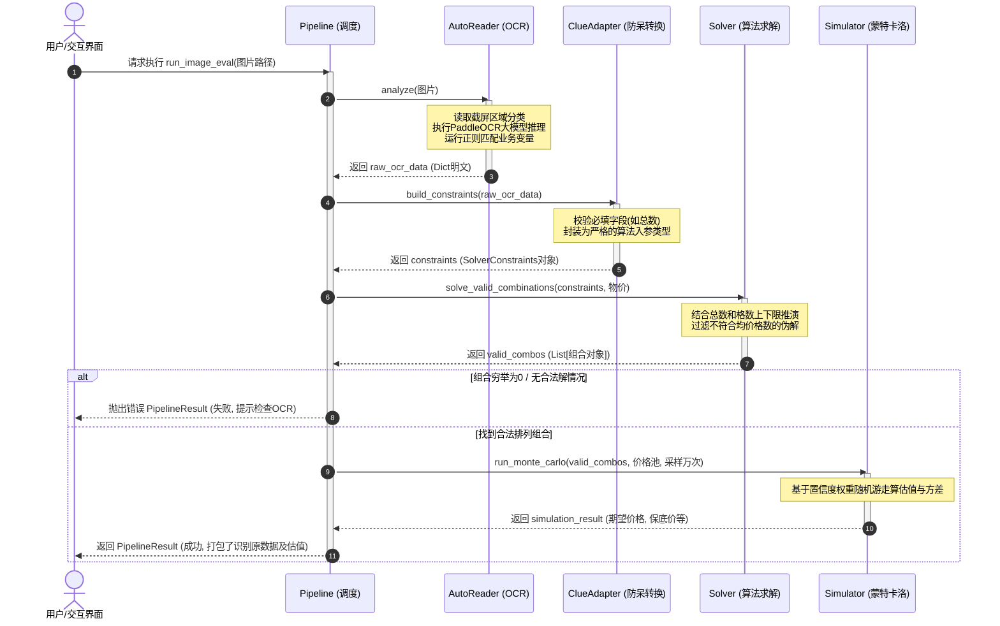

# 竞拍之王实时估值辅助 - 系统架构与流程文档

## 1. 系统模块调用关系图 (Call Graph)

以下是系统整体的模块调用层级，从外部入口到核心引擎的流向：

---

## 2. 核心文件职责与能力说明 (Responsibilities)

| 文件路径 | 模块名称 | 属于分层 | 核心职责说明 | 能力与特点 |
| :--- | :--- | :--- | :--- | :--- |
| `src/pipeline.py` | **估值调度器** | 调度层 | 负责将孤立的各个底层模块串联，实现“一键估值”。对外屏蔽底层复杂逻辑。 | 捕获运行时间、提供日志输出、统一异常捕获。向前端吐出 `PipelineResult`。 |
| `src/auto_reader.py` | **图像感知引擎** | 感知层 | 封装 PaddleOCR。输入游戏截图，输出纯字典结构的正则化数据信息。 | 不包含任何估值逻辑，极度解耦。内置针对截屏特定比例的 ROI（感兴趣区域）硬编码切割。 |
| `src/clue_adapter.py` | **数据适配器** | 适配层 | 将 OCR 提取的非结构化字典，清洗防呆后转换为数学引擎所需的严格 `SolverConstraints` 模型。 | 错误拦截（如缺少总数）。补全缺失的变量默认值，放宽浮点计算容忍度。 |
| `src/solver.py` | **数学求解引擎** | 计算层 | 基于用户给定的约束（总数、均格数、均价等），利用 DFS 与后缀和安全剪枝算法，推演出所有可能的藏品颜色组合情况。 | 纯 CPU 密集型任务，极高效率的排列组合算力（十万级迭代秒级完成）。 |
| `src/simulator.py` | **蒙特卡洛模拟器** | 计算层 | 对求解器输出的所有合法组合，根据本地物价库运用随机游走计算，得出平滑的期望值与风险分位数。 | 提供 1%悲观保底价、95%安全出价等统计学金融指标输出。 |
| `src/data_loader.py` | **静态数据中心** | 基础层 | 将磁盘上的 CSV/JSON 物料读取到内存字典中。 | 缓存提速设计，避免高频 IO。 |
| `src/models.py` | **数据模型约定** | 基础层 | 定义系统中流通的各种核心数据结构 (`@dataclass`)，确保全系统类型安全。 | 包含 `CountCombination`, `SolverConstraints` 等核心结构。 |

---

## 3. 端到端估值时序图 (Sequence Flow)

该图展示了当我们执行一次自动化估值 (`pipeline.run_image_eval`) 时，时间线上的操作顺延：

